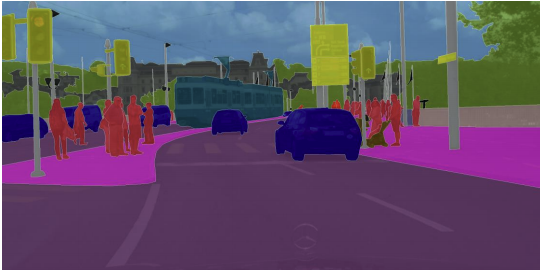

# Image Segmentation with U-Net

In this project, we will explore the implementation of U-Net, a convolutional neural network (CNN) architecture known for its effectiveness in image segmentation tasks. Our goal is to predict pixel-wise labels within images from a self-driving car dataset, a task that demands precision and accuracy. This README file provides an overview of the project and the steps involved in creating a U-Net model for image segmentation.

## Project Overview

This project was undertaken as part of the Deep Learning Specialization course offered on Coursera. Our objective is to delve into the U-Net architecture and its potential in image segmentation tasks. We will build a U-Net model that takes in images and predicts labels for each pixel, enabling us to identify objects of interest within the images.

## Getting Started

### Load the Data

Before we begin constructing the U-Net model, we need to load the image data. The dataset consists of images and their corresponding masks. The masks contain pixel-level annotations indicating the object boundaries or areas of interest.

### Create Datasets

We create TensorFlow datasets to efficiently manage our image and mask data during training and evaluation. These datasets facilitate lazy loading and preprocessing of data, ensuring memory efficiency.

### Preprocess the Data

We preprocess the data by implementing functions to read, decode, and resize the images and masks. These functions are applied to the dataset, preparing the data for input into the model during training and evaluation.

## Data Pipeline

We build a data processing pipeline using TensorFlow's Dataset API. This pipeline involves two stages of mapping: first, mapping the `process_path` function to handle file reading and decoding, and then mapping the `preprocess` function to perform resizing and preparation.

## U-Net Architecture

The U-Net architecture is divided into two main components: the encoder and the decoder. These components work together to achieve accurate image segmentation.

### Encoder

The encoder is responsible for capturing high-level features from the input images through a series of convolutional and pooling layers. It effectively reduces image dimensions while increasing channel depth.

### Decoder

The decoder takes the encoded features and reconstructs the original image dimensions while reducing channel depth. It employs transposed convolutions and skip connections to refine the segmentation predictions.

### Final Feature Mapping Block

The final layer of the decoder is a 1x1 convolutional layer that maps the learned features to the specified number of classes. Each class is represented by a channel in the output tensor.

### U-Net Model Construction

We define the `unet_model` function to construct the U-Net architecture. This function takes input shape, filter count, and class count as parameters. It combines the encoder and decoder components to create the complete U-Net model.

## Training the Model

With the U-Net model constructed, we can proceed to train it using our prepared dataset. During training, the model learns to predict pixel-level labels based on the input images and corresponding masks.

## Plotting Model Accuracy

Once the model is trained, we can visualize its accuracy by plotting relevant metrics such as loss and accuracy over epochs. This visualization helps us assess the performance of the trained U-Net model.

## Conclusion

In this project, we have explored the U-Net architecture and its application in image segmentation tasks. By constructing and training a U-Net model, we aim to accurately predict pixel-wise labels within images from a self-driving car dataset. The process involves data loading, preprocessing, model construction, and training. The U-Net architecture's unique encoder-decoder design allows us to achieve accurate and efficient image segmentation, making it a valuable tool in computer vision applications.
